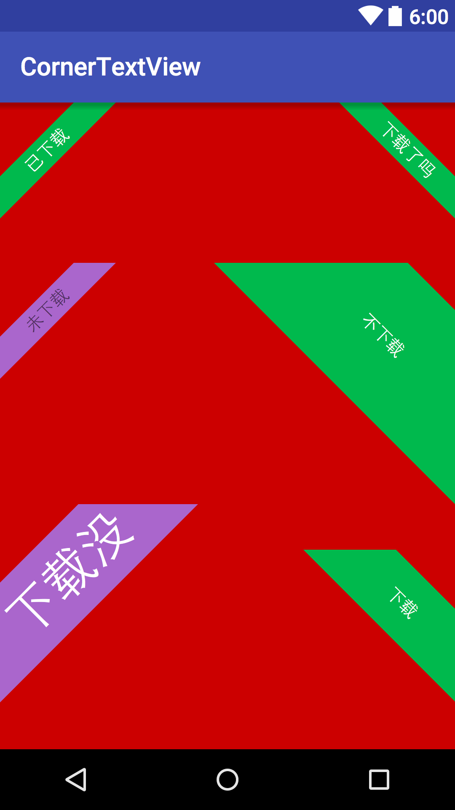

#~~CornerTextView(Deprecated)~~

##Do not use this.use [linger1216/labelview](https://github.com/linger1216/labelview).

CornerTextView,LabelView,TiltTextView,倾斜TextView.



I did not do adaptation.for reference only.我没做完适配,可能会有别的问题.仅供参考.

#Import to your Project.

1.Copy CornerTextView.java to your project's package.
2.Copy attrs_corner_text_view to your project's res/values.
3.Add CornerTextView in your layout xml file.

#Useage

```xml

    <com.fanhl.cornertextview.CornerTextView
        android:layout_width="wrap_content"
        android:layout_height="wrap_content"
        android:layout_alignParentLeft="true"
        android:layout_alignParentStart="true"
        android:layout_below="@+id/view3"
        android:text="下载没"
        android:textColor="@android:color/white"
        android:textSize="40sp"
        app:beltColor="@android:color/holo_purple"
        app:distance="40dp"
        app:gravity="topLeft"
        app:strokeWidth="0dp"/>

```

#License

Copyright 2015 dyguests.

MIT.just use it.have fun.
